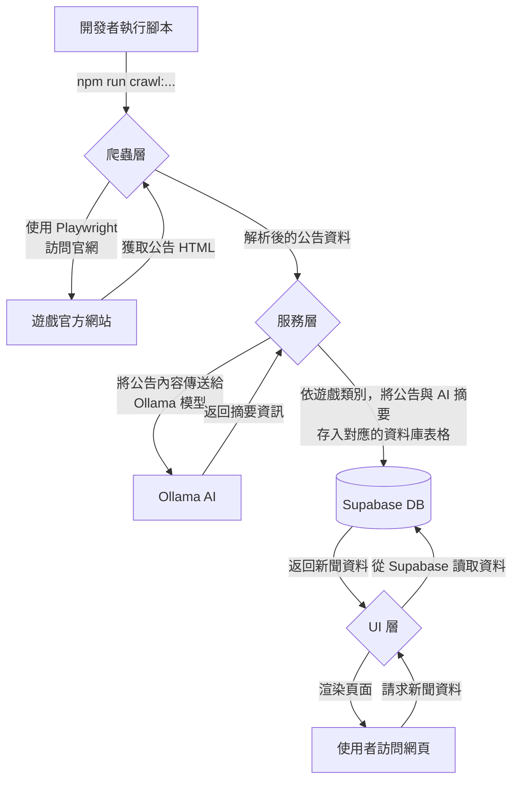

# 遊戲快報 (Game News Express)

本專案旨在集中爬取多款遊戲的官方網站公告，透過本地 AI 模型分析與摘要後，以結構化、易於閱讀的形式呈現給玩家。

首波支援遊戲：
- **蔚藍檔案 (Blue Archive)**
- **公主連結 (Princess Connect! Re: Dive)**

---

## 🚀 功能特色 (Features)

- **統一爬蟲架構**：採用 TypeScript 與 Playwright 統一開發，確保程式碼一致性與可維護性。
- **AI 內容摘要**：使用本地運行的 Ollama 模型對新聞內容進行分析，提取關鍵資訊（如活動時間、重點內容、角色名稱）。
- **結構化呈現**：將新聞依據「活動」、「招募」、「更新」等標準化類別進行分類與展示。
- **動態遊戲路由**：採用 `games/[slug]` 動態路由，方便未來擴充支援更多遊戲。
- **圖片自動抓取**：爬蟲會自動嘗試抓取與公告內容最相關的代表性圖片。
- **資料庫整合**：使用 Supabase 儲存爬取與分析後的遊戲新聞資料。
- **響應式設計**：確保在桌面與行動裝置上皆有良好的瀏覽體驗。

---

## 🏗️ 專案架構 (Project Architecture)

本專案採用分層架構，將不同職責的程式碼分離，以提高可維護性和擴展性。

```
/
├── src/
│   ├── app/                # UI 層 (Next.js App Router)
│   │   ├── page.tsx          # 首頁
│   │   └── games/[slug]/     # 動態遊戲新聞頁面
│   ├── components/           # 共用 React 元件
│   ├── hooks/                # 共用 React Hooks
│   ├── lib/                  # 服務層 (Service Layer)
│   │   ├── supabase.ts       # Supabase 客戶端與資料庫操作
│   │   ├── ollama.ts         # Ollama AI 模型互動邏輯
│   │   └── crawler.ts        # 公主連結爬蟲核心邏輯 (Playwright)
│   ├── types/                # 全域 TypeScript 型別定義
│   └── scripts/              # 爬蟲啟動腳本 (TypeScript)
│       ├── run-pcr-crawler.ts
│       └── run-bluearchive-crawler.ts
├── public/                 # 靜態資源 (圖片, 圖標)
├── tests/                  # 測試目錄
└── package.json
```

-   **UI 層 (UI Layer)**：位於 `src/app` 和 `src/components`，基於 Next.js App Router，負責處理頁面路由、元件渲染和使用者互動。
-   **服務層 (Service Layer)**：位於 `src/lib`，是應用的核心業務邏輯所在。負責與外部服務溝通，包括 Supabase 資料庫和本地 Ollama 模型。
-   **爬蟲層 (Crawler Layer)**：位於 `src/scripts` 和 `src/lib`，**統一使用 TypeScript** 撰寫，負責從遊戲官網提取原始資料。

---

## 🌊 專案流程 (Project Flow)

整個專案的資料流從爬蟲開始，到最終在前端頁面呈現，主要流程如下：



1.  **觸發爬蟲**：開發者在終端執行 `npm run crawl:bluearchive` 或 `npm run crawl:pcr` 命令。
2.  **資料爬取**：對應的爬蟲腳本啟動 Playwright 無頭瀏覽器，訪問遊戲官網的新聞頁面。
3.  **AI 摘要**：爬蟲將每條公告的詳細內容傳送給 `ollama.ts` 服務，該服務呼叫本地運行的 Ollama AI 模型生成摘要與提取關鍵字。
4.  **資料儲存**：爬蟲將原始公告內容和 AI 生成的摘要，一同儲存到 Supabase 資料庫中。
5.  **前端呈現**：當使用者瀏覽網站時，Next.js 頁面會向 `supabase.ts` 服務發出請求，從資料庫中獲取格式化後的新聞資料，並將其渲染成使用者看到的頁面。

---

## 🗄️ 資料庫結構 (Database Schema)

本專案針對不同遊戲的資料特性，採用了 **獨立的資料表** 進行儲存。

### 1. `news` (公主連結 - 活動類)
儲存「公主連結」的**活動、轉蛋、戰隊競賽**等有明確時間區間的新聞。
-   `id`: `uuid` - 主鍵。
-   `title`: `text` - 公告標題。
-   `content`: `text` - 公告完整內文。
-   `summary`: `text` - 由 AI 生成的摘要。
-   `date`: `timestamp` - 公告的發布日期。
-   `start_date`: `timestamp` - 活動或內容的開始時間。
-   `end_date`: `timestamp` - 活動或內容的結束時間。
-   `category`: `text` - 主要分類（活動, 轉蛋, 戰隊戰）。
-   `image_url`: `text` - 公告的主要圖片連結。
-   `url`: `text` (Unique) - 原始公告的網頁連結，具唯一性約束。

### 2. `updates` (公主連結 - 更新類)
儲存「公主連結」的**遊戲版本更新、角色實裝**等非活動類新聞。
-   `id`: `bigint` - 主鍵。
-   *其餘欄位與 `news` 表大致相同，用於區分不同性質的公告。*

### 3. `blue_archive_news` (蔚藍檔案)
專為「蔚藍檔案」設計，儲存其所有類型的新聞公告。
-   `id`: `integer` - 主鍵。
-   `thread_id`: `varchar` - 儲存 Nexon 論壇的文章 `threadId`。
-   `character_names`: `text[]` - 儲存 AI 從公告中分析出的角色名稱陣列。
-   `category`: `text` - **標準化分類**，用於前端篩選 (例如: '活動', '招募')。
-   `sub_category`: `text` - **原始分類**，儲存從官網直接抓取的分類 (例如: '活動劇情', '特選招募')。
-   `image_url`: `text` - 公告的主要圖片連結。
-   *其餘欄位與公主連結的表共通。*

---

## ⚙️ 爬蟲運作原理 (Crawler Principles)

本專案針對不同遊戲網站的結構，採用了不同的爬蟲策略，但**統一使用 Playwright** 作為核心技術。

### 蔚藍檔案 (Blue Archive)
-   **腳本**: `src/scripts/run-bluearchive-crawler.ts`
-   **技術**: TypeScript, Playwright
-   **目標資料表**: `blue_archive_news`
-   **運作方式**:
    1.  **清空資料表**：任務開始時，首先會清空 `blue_archive_news` 資料表，確保每次都抓取最新的完整資料。
    2.  **訪問與驗證**：導覽至 Nexon 論壇公告列表，進入最新一篇「遊戲更新說明」的公告，並驗證頁面是否包含「更新主要日程」的關鍵結構。
    3.  **解析日程表**：解析「更新主要日程」表格，提取出所有獨立事件（如：總力戰、招募、活動等）。
    4.  **內容定位與圖片抓取**：針對每一個事件，在頁面中尋找其對應的詳細文字內容區塊，並嘗試抓取其上方的代表性圖片。
    5.  **分類標準化**：將抓取到的原始分類（如 '活動劇情'）轉換為標準分類（'活動'），以便前端進行篩選。
    6.  **AI 分析 & 儲存**：將事件內容傳送給 Ollama 進行摘要，最後將組合後的完整資料存入資料庫。

### 公主連結 (Princess Connect)
-   **腳本**: 由 `src/scripts/run-pcr-crawler.ts` 觸發，核心邏輯位於 `src/lib/crawler.ts`
-   **技術**: TypeScript, Playwright
-   **目標資料表**: `news` (活動) / `updates` (更新)
-   **運作方式**:
    1.  **增量更新**：爬蟲從新聞列表的第一頁開始，逐頁向後遍歷。
    2.  **重複檢查**：檢查頁面中每一則新聞的 URL 是否已存在於 `news` 或 `updates` 資料表中。一旦遇到已存在的公告，即停止任務，確保只抓取最新的資料。
    3.  **分類與解析**：根據公告的標題和分類判斷其性質，進入詳細頁面提取完整的文章內容與圖片。
    4.  **AI 分析 & 儲存**：將文章內容傳送給 Ollama 進行摘要，並從中提取結構化的活動起訖時間，最後存入對應的資料庫表格。

---

## 🏁 開始使用 (Getting Started)

### 1. 環境準備
- 安裝 [Node.js](https://nodejs.org/) (v18 或更高版本)
- 註冊並建立一個 [Supabase](https://supabase.com/) 專案
- 安裝並運行 [Ollama](https://ollama.com/)，並拉取模型 (`ollama pull gemma3:4b`)

### 2. 安裝與設定
1.  **複製專案**
    ```bash
    git clone https://github.com/your-repo/game-news-express.git
    cd game-news-express
    ```

2.  **安裝依賴**
    ```bash
    npm install
    ```

3.  **設定環境變數**
    手動建立 `.env.local` 檔案，並填入您的 Supabase 專案資訊。
    ```
    # .env.local
    NEXT_PUBLIC_SUPABASE_URL="YOUR_SUPABASE_URL"
    NEXT_PUBLIC_SUPABASE_ANON_KEY="YOUR_SUPABASE_ANON_KEY"
    OLLAMA_API_BASE_URL="http://localhost:11434"
    ```

### 3. 啟動開發伺服器
```bash
npm run dev
```
應用程式將會運行在 `http://localhost:3000`。

---

## 📜 可用腳本 (Available Scripts)

-   `npm run dev`: 啟動開發模式。
-   `npm run build`: 建立生產版本。
-   `npm run start`: 運行生產版本。
-   `npm run lint`: 執行 ESLint 程式碼檢查。
-   `npm run crawl:pcr`: 執行公主連結的爬蟲腳本。
-   `npm run crawl:bluearchive`: 執行蔚藍檔案的爬蟲腳本。
-   `npm run check:db`: 檢查資料庫連線狀態。 