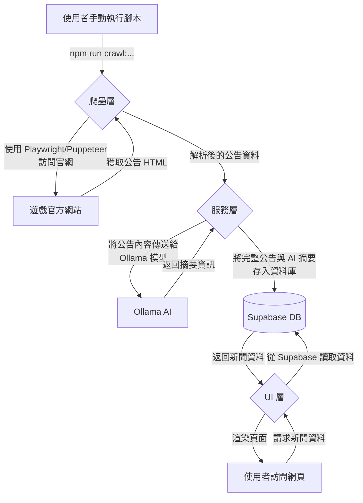

# 遊戲快報 (Game News)

本專案旨在集中爬取多款遊戲的官方網站公告，透過本地 AI 模型分析與摘要後，以結構化、易於閱讀的形式呈現給玩家。

首波支援遊戲：
- **蔚藍檔案 (Blue Archive)**
- **公主連結 (Princess Connect! Re: Dive)**

---

## 🚀 功能特色 (Features)

- **自動化爬蟲**：定時爬取指定遊戲官網的最新公告。
- **AI 內容摘要**：使用本地運行的 Ollama 模型對新聞內容進行分析，提取關鍵資訊（如活動時間、重點內容）。
- **結構化呈現**：將新聞依據「活動」、「招募」、「更新」等類別進行分類與展示。
- **動態遊戲路由**：採用 `games/[slug]` 動態路由，方便未來擴充支援更多遊戲。
- **資料庫整合**：使用 Supabase 儲存爬取與分析後的遊戲新聞資料。
- **響應式設計**：確保在桌面與行動裝置上皆有良好的瀏覽體驗。

---

## 🏗️ 專案架構 (Project Architecture)

本專案採用分層架構，將不同職責的程式碼分離，以提高可維護性和擴展性。

```
/
├── src/
│   ├── app/                # UI 層 (Next.js App Router)
│   │   ├── page.tsx          # 首頁
│   │   └── games/[slug]/     # 動態遊戲新聞頁面
│   ├── components/           # 共用 React 元件
│   ├── lib/                  # 服務層 (Service Layer)
│   │   ├── supabase.ts       # Supabase 客戶端與資料庫操作
│   │   ├── ollama.ts         # Ollama AI 模型互動邏輯
│   │   └── crawler.ts        # 爬蟲共用模組 (Playwright)
│   └── types/                # TypeScript 型別定義
├── scripts/                # 爬蟲層 (Crawler Layer)
│   └── run-bluearchive-crawler.js # Puppeteer 爬蟲腳本
├── public/                 # 靜態資源 (圖片, 圖標)
├── tests/                  # 測試目錄
└── package.json
```

-   **UI 層 (UI Layer)**：位於 `src/app` 和 `src/components`，基於 Next.js App Router，負責處理頁面路由、元件渲染和使用者互動。它會從服務層獲取資料並呈現給使用者。
-   **服務層 (Service Layer)**：位於 `src/lib`，是應用的核心業務邏輯所在。負責與外部服務溝通，包括：
    -   `supabase.ts`: 處理所有與 Supabase 資料庫的 CRUD 操作。
    -   `ollama.ts`: 封裝與本地 Ollama 模型的 API 互動，用於生成內容摘要。
-   **爬蟲層 (Crawler Layer)**：位於 `scripts` 和 `src/lib/crawler.ts`，負責從遊戲官網提取原始資料。每個爬蟲都是一個獨立的腳本，可以手動或定時執行。

---

## 🌊 專案流程 (Project Flow)

整個專案的資料流從爬蟲開始，到最終在前端頁面呈現，主要流程如下：



1.  **觸發爬蟲**：開發者在終端執行 `npm run crawl:bluearchive` 或 `npm run crawl:pcr` 命令。
2.  **資料爬取**：對應的爬蟲腳本啟動無頭瀏覽器（Puppeteer 或 Playwright），訪問遊戲官網的新聞頁面，並抓取公告列表的 HTML 內容。
3.  **AI 摘要**：爬蟲將每條公告的詳細內容傳送給 `ollama.ts` 服務，該服務呼叫本地運行的 Ollama AI 模型生成摘要。
4.  **資料儲存**：爬蟲將原始公告內容和 AI 生成的摘要，一同儲存到 Supabase 資料庫中。爬蟲會檢查資料是否已存在，以避免重複寫入。
5.  **前端呈現**：當使用者瀏覽網站時，Next.js 頁面會向 `supabase.ts` 服務發出請求，從資料庫中獲取格式化後的新聞資料，並將其渲染成使用者看到的頁面。

---

## ⚙️ 爬蟲運作原理 (Crawler Principles)

本專案針對不同遊戲網站的結構，採用了兩種不同的爬蟲技術。

### 蔚藍檔案 (Puppeteer)
-   **腳本**: `scripts/run-bluearchive-crawler.js`
-   **技術**: Puppeteer
-   **運作方式**:
    1.  啟動 Puppeteer 並開啟新的瀏覽器頁面。
    2.  直接訪問蔚藍檔案官網的「新聞」頁面。
    3.  使用 `page.$$eval()` 方法在瀏覽器上下文中執行腳本，抓取新聞列表 (`.news-list__item`) 中的每一條公告。
    4.  針對每一條公告，提取其標題、連結、發布日期和分類標籤。
    5.  進入每一條公告的詳細頁面，提取完整的內文。
    6.  將內文傳送給 Ollama 服務進行摘要。
    7.  將組合後的完整資料存入 Supabase 資料庫。

### 公主連結 (Playwright)
-   **腳本**: `src/lib/crawler.ts` (由 `src/scripts/run-crawler.ts` 觸發)
-   **技術**: Playwright
-   **運作方式**:
    1.  使用 `crawler.ts` 中封裝的 `Crawler` 類別，該類別對 Playwright 進行了初始化。
    2.  訪問公主連結官網的新聞頁面。
    3.  Playwright 等待新聞列表容器 (`#news_list`) 出現。
    4.  遍歷列表中的每個 `<li>` 元素，提取標題、連結和日期。
    5.  由於公主連結的公告內容是透過 AJAX 動態加載到一個彈出視窗中的，爬蟲會模擬點擊每一則新聞。
    6.  監聽並攔截對 `news_detail.php` 的請求，從中直接獲取包含完整公告內容的 HTML 片段。
    7.  將獲取的 HTML 內容傳送給 Ollama 進行摘要，並存入 Supabase。

---

## 🏁 開始使用 (Getting Started)

### 1. 環境準備
- 安裝 [Node.js](https://nodejs.org/) (v18 或更高版本)
- 註冊並建立一個 [Supabase](https://supabase.com/) 專案
- 安裝並運行 [Ollama](https://ollama.com/)，並拉取模型 (`ollama pull gemma`)

### 2. 安裝與設定
1.  **複製專案**
    ```bash
    git clone https://github.com/your-repo/game-news-express.git
    cd game-news-express
    ```

2.  **安裝依賴**
    ```bash
    npm install
    ```

3.  **設定環境變數**
    手動建立 `.env.local` 檔案，並填入您的 Supabase 專案資訊。
    ```
    # .env.local
    NEXT_PUBLIC_SUPABASE_URL="YOUR_SUPABASE_URL"
    NEXT_PUBLIC_SUPABASE_ANON_KEY="YOUR_SUPABASE_ANON_KEY"
    OLLAMA_API_BASE_URL="http://localhost:11434"
    ```

### 3. 啟動開發伺服器
```bash
npm run dev
```
應用程式將會運行在 `http://localhost:3000`。

---

## 📜 可用腳本 (Available Scripts)

-   `npm run dev`: 啟動開發模式。
-   `npm run build`: 建立生產版本。
-   `npm run start`: 運行生產版本。
-   `npm run lint`: 執行 ESLint 程式碼檢查。
-   `npm run crawl:pcr`: 執行公主連結的爬蟲腳本。
-   `npm run crawl:bluearchive`: 執行蔚藍檔案的爬蟲腳本。
-   `npm run check:db`: 檢查資料庫連線狀態。 